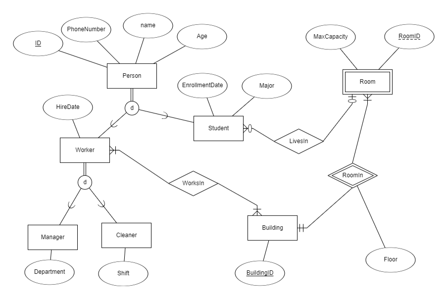
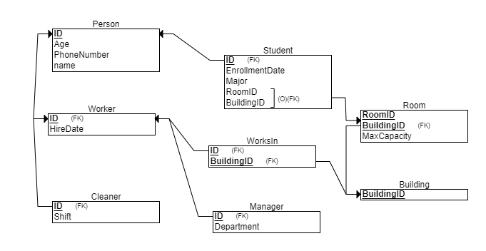

# Dormitory Control Database Project

## Introduction

We are part of the Lev group, which is dedicated to creating a comprehensive system for a university. The subdivision that my colleague Yair Shprecher and I are working on focuses on managing the university's dormitories.

## Project Overview

This project was developed by **Yonatan Berkovitch** and **Yair Shprecher** as part of our coursework at Lev. The aim of the project is to design and implement a database system for managing university dormitories. This README file outlines the project's process and specifies its components.

## Stage 1 - Design

### The Project

Our group at Lev has a clear target: to create a comprehensive database for managing university dormitory facilities. Our specific focus is on the dormitory control component.

### The Components

The dormitory control component of the project comprises seven key entities and one relationship.

### Entities

1. **Person**
   - Represents an individual associated with the dormitories.
   - **Fields**:
     - `ID` (Integer, Primary Key) - A unique identifier for the person.
     - `PhoneNumber` (String) - The person's phone number.
     - `Age` (Integer) - The person's age.
     - `Name` (String) - The person's name.

2. **Student**
   - A student residing in the dormitories.
   - **Inherits**: `Person`
   - **Fields**:
     - `RoomID` (Integer, Foreign Key) - References the room the student is assigned to.
     - `BuildingID` (Integer, Foreign Key) - References the building the student's room is part of.
     - `EnrollmentDate` (Date) - The date the student enrolled in the dormitory.
     - `FieldOfStudy` (String) - The student's major field of study.

3. **Worker**
   - Represents a worker associated with the dormitories, including both managers and cleaners.
   - **Inherits**: `Person`
   - **Fields**:
     - `HireDate` (Date) - The date the worker was hired.

4. **Manager**
   - Oversees either the facility maintenance or the overall administration of the dormitory.
   - **Inherits**: `Worker`
   - **Fields**:
     - `DepartmentType` (String) - The type of department the manager is part of.

5. **Cleaner**
   - Responsible for the cleanliness and upkeep of the dormitory buildings.
   - **Inherits**: `Worker`
   - **Fields**:
     - `ShiftType` (String) - The type of shift the cleaner works.

6. **Building**
   - Represents a dormitory building within the university campus.
   - **Key**: `BuildingID` (Integer, Primary Key) - A unique identifier for the building.
   - **Fields**:
     - `Address` (String) - The address of the building.

7. **Room**
   - Represents a room within a dormitory building, accommodating students. It is a weak entity dependent on the Building entity.
   - **Key**: 
     - `RoomID` (Integer, Composite Key) - A unique identifier for the room.
     - `BuildingID` (Integer, Foreign Key) - References the building the room is part of.
   - **Fields**:
     - `MaxCapacity` (Integer) - The maximum number of students the room can accommodate.
     - `FloorNumber` (Integer) - The floor number where the room is located.

### Relationships

1. **WorksIn**
   - Represents the relationship between a worker and the buildings they work in.
   - **Fields**:
     - `WorkerID` (Integer, Foreign Key) - References the worker.
     - `BuildingID` (Integer, Foreign Key) - References the building.
     - **Composite Key**: (`WorkerID`, `BuildingID`)

## Entity-Relationship Diagram (ERD)

## Data-Structure Diagram (DSD)

